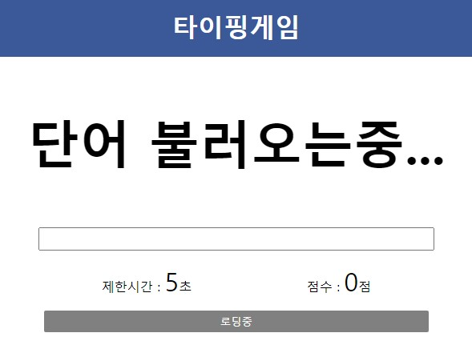
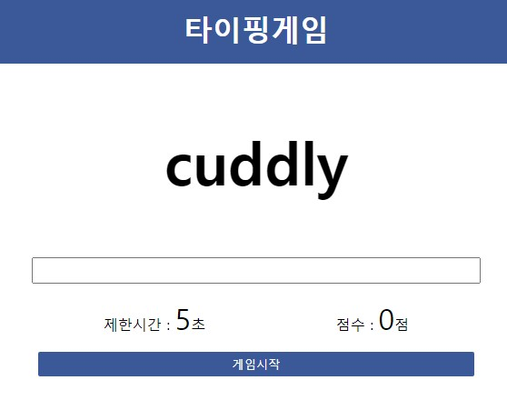
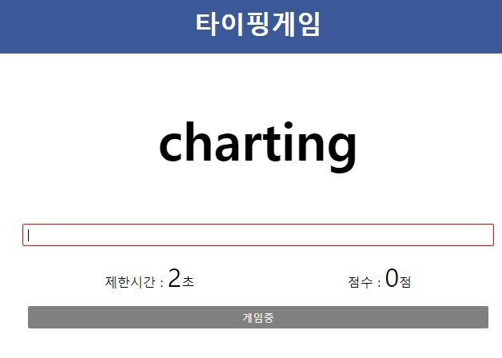

# 타이핑게임

### 구성

#### -html

> - 해더
> - 단어 디스플레이
> - 단어 입력
> - 제한 시간 및 점수
> - 버튼

#### -javascript

> **로딩( init() )**
> ㄴ 랜덤단어API에서 랜덤단어 100개 호출 및 word배열에 저장
> ㄴ 버튼을 '로딩중' 으로 설정 (게임시작 외에는 클릭불가)
> ㄴ 점수 및 시간 초기화
>
> **로딩완료**
> ㄴ 버튼을 '게임시작' 으로 변경, 클릭가능하게 설정
>
> **게임중**
> ㄴ 버튼을 '게임중' 으로 변경 및 isPlaying = true 설정, setTimeout을 이용해 countDown
> ㄴ 입력 후 엔터를 쳤을 때 입력단어와 디스플레이 단어를 비교후 같으면 시간재설정, 점수++, .wrong 제거, randomWord() 호출
> ㄴ 다르면 입력창에 .wrong class 추가(빨간색 상자)
> () 1초마다 호출
>
> **카운트 다운**
> ㄴ .time을 변수로 지정하고 0보다 크면 time--를, 작으면 isPlaying = false로 설정
> ㄴ isPlaying이 false이면 점수를 alert으로 띄우고 init() 호출
>
> **랜덤단어**
> ㄴ 0~99의 랜덤숫자를 생성해 word의 인덱스로 주어 랜덤단어 설정
>
> **사용자 입력**
> ㄴ isPlaying이 false일때 입력시 공백으로 초기화
>
> #

---

#

#### -스크린샷

